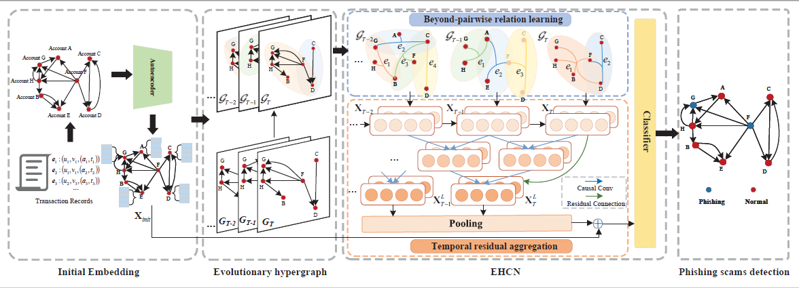

# EHCN

This is the source code for the paper "[An Evolutionary Hypergraph Convolutional Network for Phishing Scams Detection on Blockchain]".

## dataset
DATASET(Bitcoin) CAN BE FOUND HERE: [Google Drive](https://drive.google.com/drive/folders/1MRPXz79Lu_JGLlJ21MDfML44dKN9R08l?usp=sharing)
DATASET(Ethereum) CAN BE FOUND HERE: [Kaggle]https://www.kaggle.com/datasets/xblock/ethereum-phishing-transaction-network


## Overview



## Requirement
```
Python 3.9
networkx == 1.11
numpy == 1.23
pytorch == 1.12
sklearn == 0.22
```

## Example Usage
To reproduce the experiments on DTI dataset, simply run:
```
python3 train.py
```
